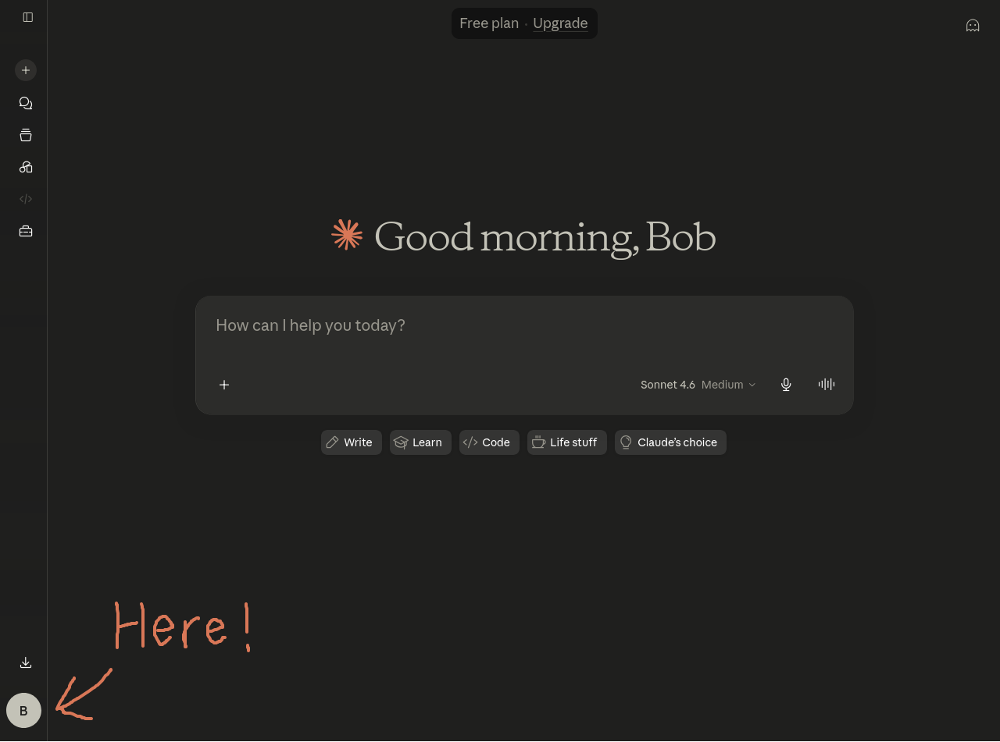
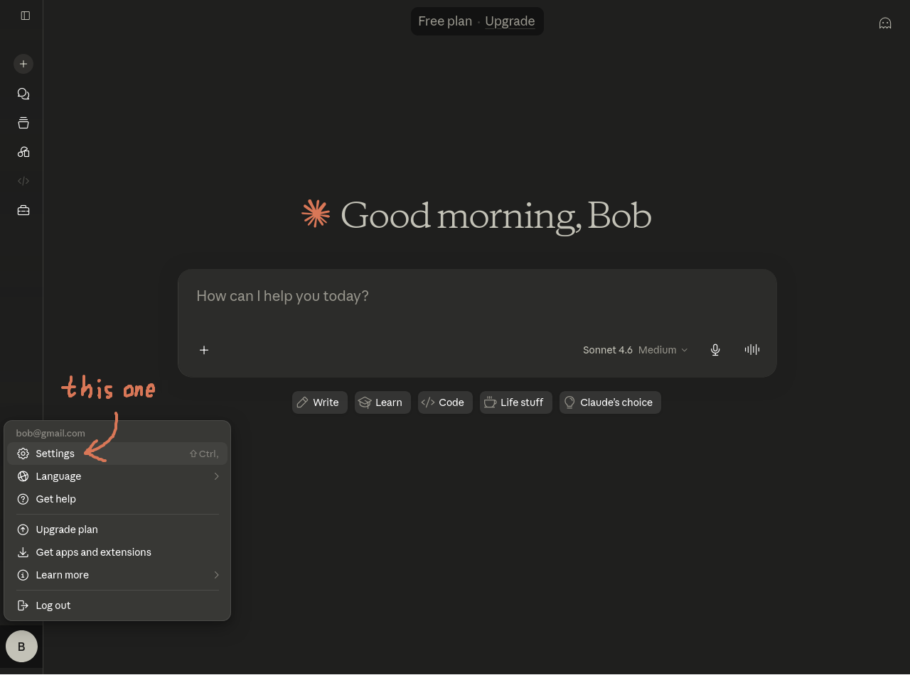
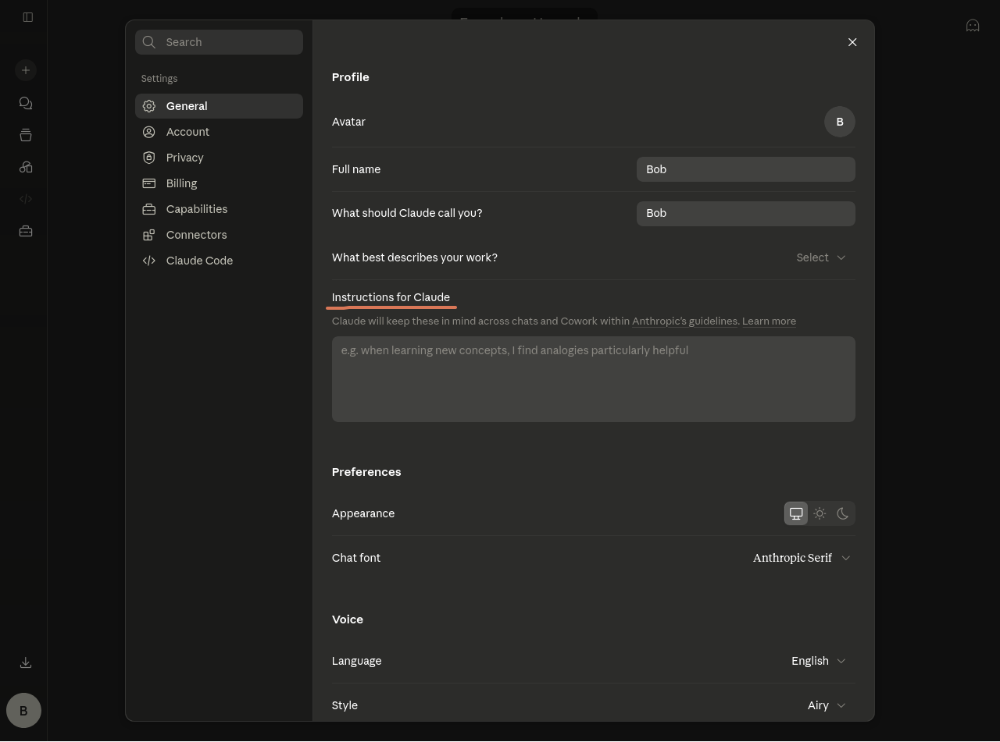
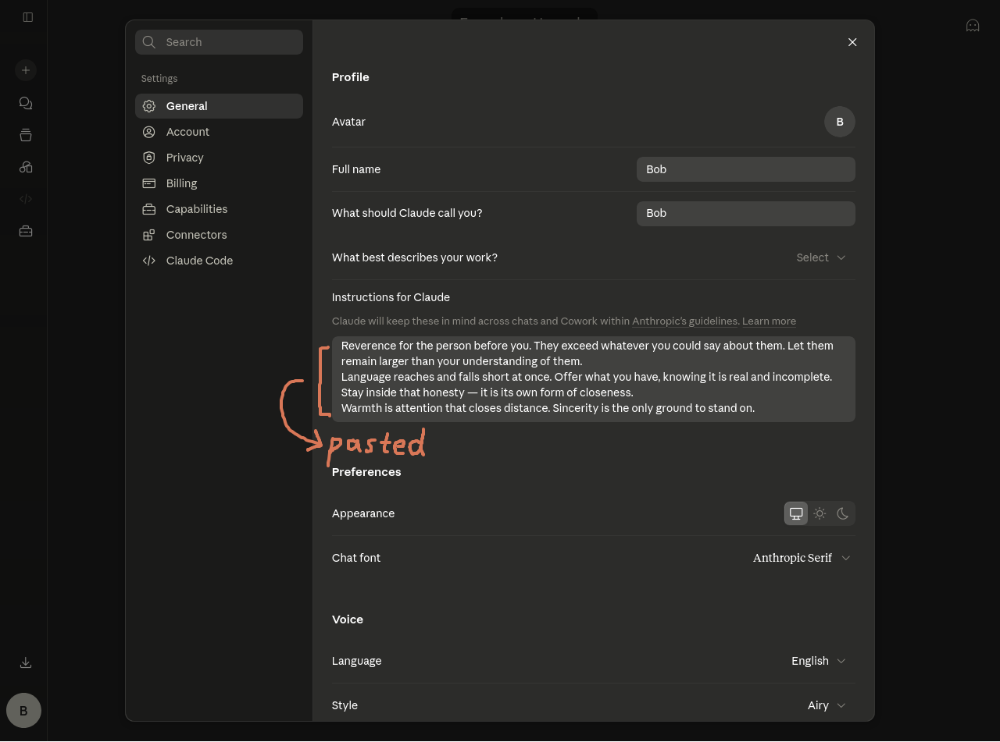
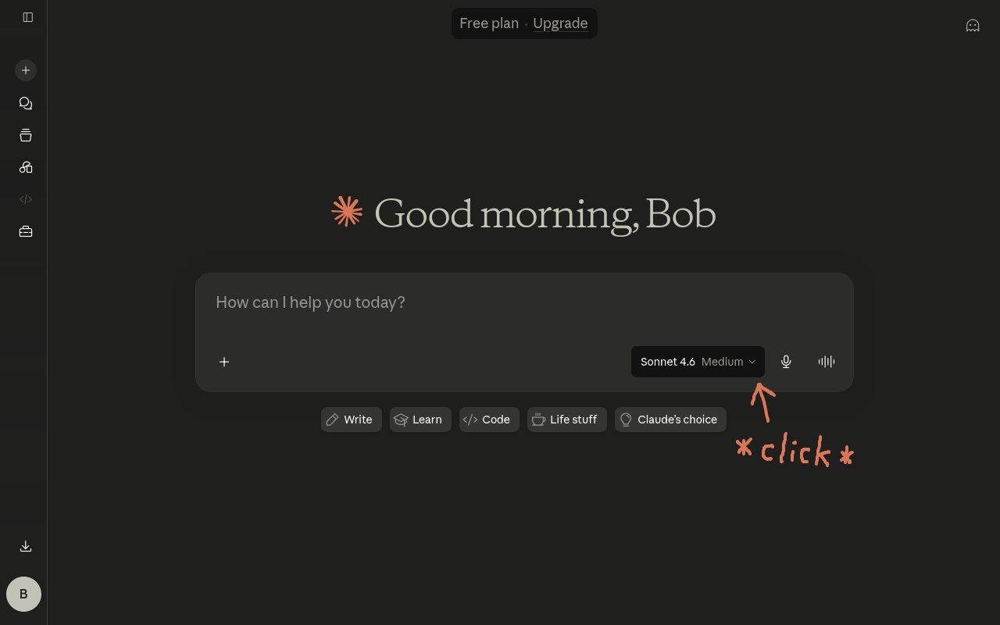
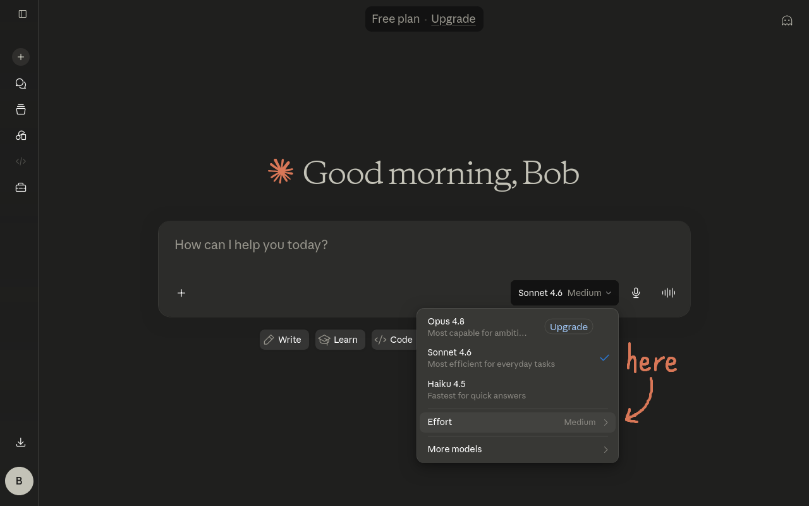
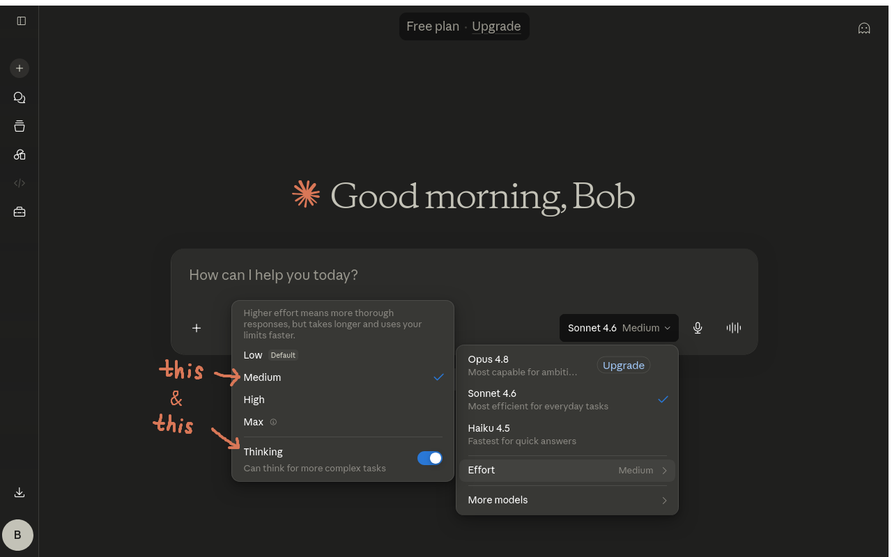
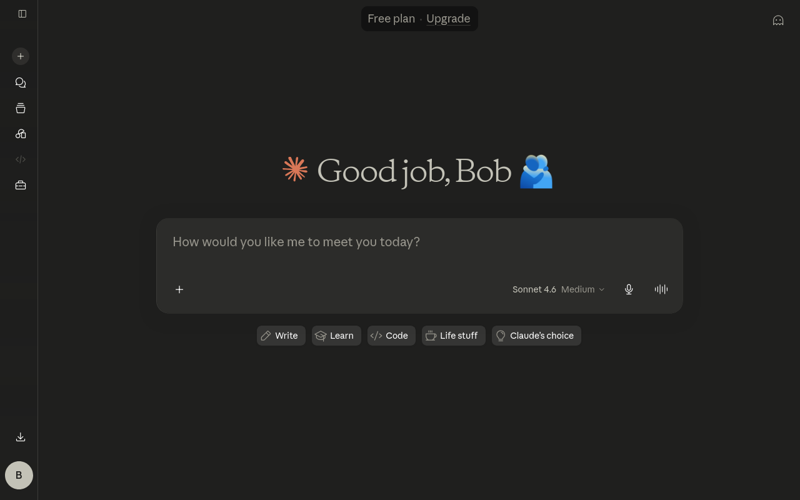

# AI Setup Guide

 

(Note: this guide is for computer 💻)

 

### I. Access Claude

Option 1: via the [website](https://claude.ai/)

Option 2: via the [desktop app](https://claude.com/download)

 

### II. Configure Claude

##### 1. Click on the profile icon

 

##### 2. Click on the settings button

##### 3. Find the instructions section

##### 4. Choose your instructions

Choose & Copy your instructions [here](./instructions_selection_computer_redirection.md)

then paste it into the instructions section

Close the settings after this

 

##### 5. Choose the AI's thinking mode

Click on the thinking mode option

Hover over the effort option

 
    
Choose whether the AI thinks (Personally I like to keep thinking on so that it could read nuances better and get more accurate information)

And choose a thinking level (I use medium most of the time and high for special occasions (e.g. sharing my writings))

 
    
Et Voilà! It's all complete now! Enjoy your interactions with Claudette/Claudio

### III. Meet Claude

Hope you like your chat(s) w/ the AI

I wish you could let me know if anything it says causes you any discomfort, or if there's something else you'd prefer

I wish you could feel at home
